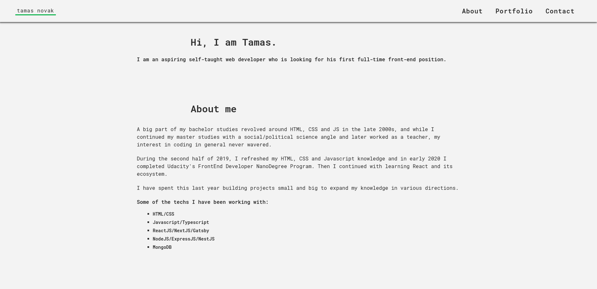

### portfolio page || project-005
#### description
+ a static site generated by Gatsby and extended with Typescript. The application is a simple portfolio site that includes project descriptions, links and means of contact.
+ the site is deployed [here](https://tamasnovak.net/).

#### used packages
```
FRONTEND
+ fontawesome          - icon package.
+ gatsby               - client-side framework.
+ google-analytics     - google analytics plugin.
+ react-helmet         - document head element handler.
+ styled-components    - css-in-js styling.
+ typescript           - javascript extension.
```

#### screenshot
